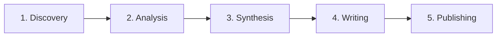

# Research Mode 🔬

Research Mode là công cụ nghiên cứu toàn diện theo quy trình **5 giai đoạn**, được thiết kế theo chuẩn **PRISMA 2020** dành cho systematic review.

## Quy trình 5 giai đoạn

### 1️⃣ Discovery — Tìm kiếm tài liệu

<Steps>
  <Step title="Nhập câu hỏi nghiên cứu">
    Nhập chủ đề hoặc câu hỏi vào ô tìm kiếm. AI sẽ tự động phân tích theo framework **PICO**:
    - **P**opulation (Dân số)
    - **I**ntervention (Can thiệp)
    - **C**omparison (So sánh)
    - **O**utcome (Kết quả)
  </Step>
  <Step title="Tìm kiếm tự động">
    Hệ thống đồng thời tìm kiếm trên:
    - **PubMed** — cơ sở dữ liệu y sinh hàng đầu thế giới
    - **OpenAlex** — cơ sở dữ liệu học thuật mở
  </Step>
  <Step title="Upload PDF (tùy chọn)">
    Kéo thả file PDF nghiên cứu vào → tự động trích xuất nội dung → thêm vào danh sách papers.
    [Xem hướng dẫn Upload PDF →](/features/pdf-upload)
  </Step>
</Steps>

### 2️⃣ Analysis — Sàng lọc & Phân tích

- **Screening**: Đánh giá từng paper — Include / Exclude / Maybe
- **Deduplication**: Tự động phát hiện và loại bỏ bài trùng lặp
- **DOI Resolver**: Tra cứu thông tin chi tiết qua DOI
- **GRADE Assessment**: Đánh giá chất lượng bằng chứng (High / Moderate / Low / Very Low)

### 3️⃣ Synthesis — Tổng hợp

- Tạo **PRISMA Flow Diagram** tự động
- Tổng hợp kết quả theo study type
- Phân tích thống kê (meta-analysis cơ bản)

### 4️⃣ Writing — Viết bài

- AI viết bản nháp systematic review theo cấu trúc chuẩn
- Bao gồm: Abstract, Introduction, Methods, Results, Discussion
- Tham chiếu đúng format (Vancouver / APA)

### 5️⃣ Publishing — Xuất bản

Nhiều định dạng xuất:

| Định dạng | Mô tả |
|---|---|
| 🌐 HTML Preview | Xem trước bài viết trong tab mới |
| 📋 Rich Copy | Copy giữ format để paste vào Word/Docs |
| 📄 Quarto QMD | File Quarto cho tạp chí khoa học |
| 📚 BibTeX | File trích dẫn cho LaTeX |
| 📝 Markdown | Markdown cho Overleaf / GitHub |
| 🗂️ References | Danh mục tham khảo Vancouver |

<Info>
Giai đoạn Publishing còn tích hợp [Kiểm tra đạo văn](/features/plagiarism-check) và [Tạo slide trình bày](/features/research-slides).
</Info>

## Cách truy cập

1. **Từ sidebar**: Bấm icon 🔬 Research trên thanh bên phải
2. **Từ chat**: Khi hỏi về chủ đề nghiên cứu, bấm nút **"Dùng Research Mode"** được gợi ý tự động
