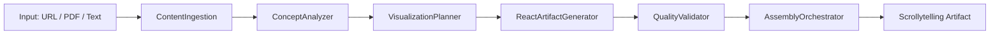

# 📄 Content Visualizer

**Content Visualizer** là tính năng cao cấp của Phở Chat — pipeline AI 7 tầng biến nội dung học thuật và tài liệu dài thành bài giảng scrollytelling trực quan.

## Pipeline hoạt động như thế nào?



<Info>
  Pipeline chạy khoảng **30-60 giây** vì gọi nhiều AI agents liên tiếp. Kết quả xứng đáng với thời gian chờ!
</Info>

## Nguồn Input hỗ trợ

| Loại | Ví dụ |
|------|-------|
| 🔗 URL arXiv | `https://arxiv.org/abs/2310.06825` |
| 🔗 URL bài viết | Link blog, Wikipedia, báo khoa học |
| 📄 PDF | Upload file PDF (qua vision) |
| ✍️ Text | Paste trực tiếp nội dung |
| 💬 Topic | Mô tả chủ đề bằng ngôn ngữ tự nhiên |

## Prompts mẫu

### 🔬 Bài báo khoa học

```
Tóm tắt và visualize bài báo này thành scrollytelling: https://arxiv.org/abs/2310.06825

Chia thành 5 section, mỗi section có: tiêu đề, visual minh họa (diagram/chart), narration tiếng Việt, và key takeaway.
```

```
Biến bài báo về CRISPR gene editing thành bài giảng trực quan cho sinh viên y khoa năm 2. URL: https://www.nature.com/articles/...

Yêu cầu: giải thích cơ chế, ứng dụng lâm sàng, và giới hạn hiện tại. Narration tiếng Việt.
```

### 🎓 Bài giảng & Giáo dục

```
Tạo bài giảng trực quan về cơ chế tác động của kháng sinh lên vi khuẩn, chia thành 5 scene có thể cuộn qua từng bước:
1. Cấu trúc vi khuẩn
2. Điểm tác động của từng loại kháng sinh
3. Cơ chế tiêu diệt
4. Kháng kháng sinh
5. Giải pháp điều trị

Dùng animation minh họa, narration tiếng Việt.
```

```
Tạo scrollytelling giải thích Machine Learning cho người mới bắt đầu — từ linear regression đến neural networks. 6 scenes, ví dụ thực tế Việt Nam.
```

### 🏥 Y tế & Bệnh nhân

```
Tạo tài liệu giải thích bệnh tiểu đường type 2 cho bệnh nhân — không dùng thuật ngữ y khoa phức tạp. 4 scene: nguyên nhân, triệu chứng, biến chứng, quản lý. Narration tiếng Việt dễ hiểu.
```

```
Visualize quy trình phẫu thuật nội soi tuyến tiền liệt (TURP) để giải thích cho bệnh nhân trước phẫu thuật. Dùng animation đơn giản, tránh hình ảnh đáng sợ.
```

### 📊 Business & Research

```
Visualize báo cáo thị trường bất động sản TP.HCM Q1/2026. Input: [paste nội dung báo cáo].

Tạo scrollytelling với: executive summary, trends chart, heatmap phân khúc, và outlook 6 tháng tới.
```

## Tính năng Scrollytelling

- **Scene navigation**: Cuộn trang để chuyển scene, hoặc dùng sidebar navigation
- **Auto-play narration**: Text-to-speech đọc narration từng scene (nếu bật)
- **Inline diagrams**: Sơ đồ từ Generative Diagrams nhúng trực tiếp
- **Quiz checkpoints**: Câu hỏi ôn tập giữa các section
- **Export**: Xuất thành standalone HTML hoặc PDF

<Warning>
  Content Visualizer tốn nhiều token hơn tính năng thông thường. Phù hợp nhất với **Phở Medical** và **Phở Pro** plans.
</Warning>
